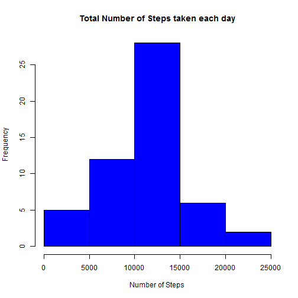
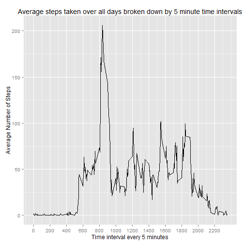
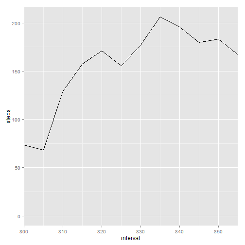
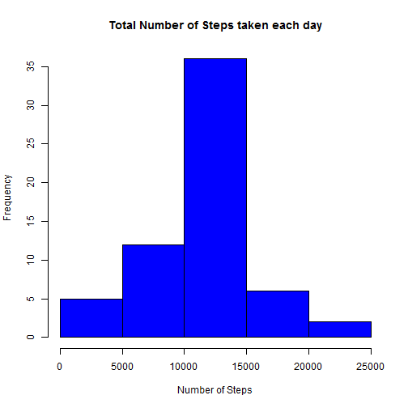
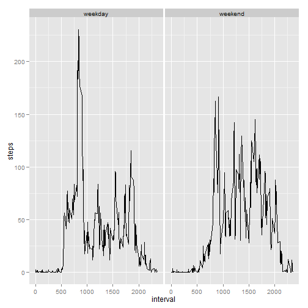

Step Data Analysis
========================================================

Step #1:
Load the Step data in by reading in the .csv file


```r
steps <- read.csv("activity.csv")
```


Clean up the data by converting the date fields into a POSIXct format for future use


```r
library(lubridate)
steps$date <- ymd(steps$date)
```

Step #2:
Figure out What is mean total number of steps taken per day

part #1: Ignore the missing data by subsetting the data so that we not include the NA's

```r
steps1 <- steps[complete.cases(steps), ]
```

part #2: Sum the steps of each interval by date and make a histogram that demonstrates the total number of steps taken each day


```r
stepsbyday <- aggregate(steps ~ date, steps1, sum)
hist(stepsbyday$steps, col = "blue", xlab = "Number of Steps", main = "Total Number of Steps taken each day")
```

 

part #3: Report the mean and median number of total steps taken per day

```r
summary(stepsbyday$steps)
```

```
##    Min. 1st Qu.  Median    Mean 3rd Qu.    Max. 
##      41    8840   10800   10800   13300   21200
```

Step #3
Figure out the average daily activity pattern by interval

part #1: Take the mean of the steps taken at each 5 minute interval across every day

```r
intervalmeans <- aggregate(steps ~ interval, steps1, mean)
```

part #2: And plot it

```r
library(ggplot2)
g <- ggplot(intervalmeans, aes(interval, steps))
g + geom_line() + scale_x_continuous(breaks = seq(0, 2355, by = 200)) + labs(y = "Average Number of Steps") + 
    labs(x = "Time interval every 5 minutes") + labs(title = "Average steps taken over all days broken down by 5 minute time intervals")
```

 

Now that we can see that the peak in average steps  occurs between the 800 and 900 interval, lets zoom in and see specifically which 5 minute interval has the highest average steps taken. The graph clearly demonstrates that the "835" interval is the single interval of the 288 separate intevals to have the highest mean of steps taken.

```r
g <- ggplot(intervalmeans, aes(interval, steps))
g + geom_line() + coord_cartesian(xlim = c(800, 855)) + scale_x_continuous(breaks = seq(from = 800, 
    to = 900, by = 10))
```

 

Step #4
Inputting missing values

part #1.Calculate and report the total number of missing values in the dataset (i.e. the total number of rows with NAs).

We can see from this summary that there are 2304 NA's in this data set of 17568 rows of data.


```r
summary(steps$steps)
```

```
##    Min. 1st Qu.  Median    Mean 3rd Qu.    Max.    NA's 
##     0.0     0.0     0.0    37.4    12.0   806.0    2304
```


part #2: There are 2304 NA's in our entire data set. We also know that there happens to be 288 "5 minute" intervals. How lucky for us that divding the 2304 NA's by 288 gives us a nice even number of 8, which should tell us that there are 8 full days in which not a single interval of the 288 intervals in that day have any data. Without literally reviewing all 2304 of these NA rows, simply spot checking does indeed confirm that there happens to be 8 full days that have nothing but NA's.

Knowing this, a simple way of filling in this data, would be to utilize the mean's of each 5 minute time interval that we derived in step 3 and simply input them neatly into each of the 288 intervals for the  8 missing days.Naturally we will need to round each mean to the nearest whole number since our measurement is of actual whole steps taken.  


part #3: Create a new dataset that is equal to the original dataset but with the missing data filled in.

```r
nasteps <- steps[!complete.cases(steps), ]
meansteps <- rep(round(intervalmeans$steps), times = 8)
nastepsfinal <- data.frame(steps = meansteps, date = nasteps$date, interval = nasteps$interval)
stepsfinal <- rbind(steps, nastepsfinal)
stepscomplete <- stepsfinal[complete.cases(stepsfinal), ]
library(plyr)
```

```
## 
## Attaching package: 'plyr'
## 
## The following object is masked from 'package:lubridate':
## 
##     here
```

```r
stepscomplete <- arrange(stepscomplete, stepscomplete$date)
```


part# 4: Make a histogram of the total number of steps taken each day and Calculate and report the mean and median total number of steps taken per day. Do these values differ from the estimates from the first part of the assignment? What is the impact of imputing missing data on the estimates of the total daily number of steps?

```r
stepsbydaycomplete <- aggregate(steps ~ date, stepscomplete, sum)
hist(stepsbydaycomplete$steps, col = "blue", xlab = "Number of Steps", main = "Total Number of Steps taken each day")
```

 

Calucluating mean and median of total steps

```r
summary(stepsbydaycomplete$steps)
```

```
##    Min. 1st Qu.  Median    Mean 3rd Qu.    Max. 
##      41    9820   10800   10800   12800   21200
```

Step #5
Are there differences in activity patterns between weekdays and weekends

Step #1:

Part #1: Create a new factor variable in the dataset with two levels - "weekday" and "weekend" indicating whether a given date is a weekday or weekend day.

```r
dates <- weekdays(stepscomplete[, "date"])
dates <- gsub("Monday", "weekday", dates)
dates <- gsub("Tuesday", "weekday", dates)
dates <- gsub("Wednesday", "weekday", dates)
dates <- gsub("Thursday", "weekday", dates)
dates <- gsub("Friday", "weekday", dates)
dates <- gsub("Saturday", "weekend", dates)
dates <- gsub("Sunday", "weekend", dates)
dates <- as.factor(dates)
stepscomplete <- data.frame(stepscomplete[, 1:2], dates, stepscomplete[, 3])
colnames(stepscomplete) <- c("steps", "date", "type", "interval")
```

Part #2: Make a panel plot containing a time series plot (i.e. type = "l") of the 5-minute interval (x-axis) and the average number of steps taken, averaged across all weekday days or weekend days (y-axis).

```r
intervalmeanscomplete <- aggregate(steps ~ interval + type, stepscomplete, mean)
```

now plot it

```r

qplot(interval, steps, data = intervalmeanscomplete, geom = "line", facets = . ~ 
    type)
```

 

